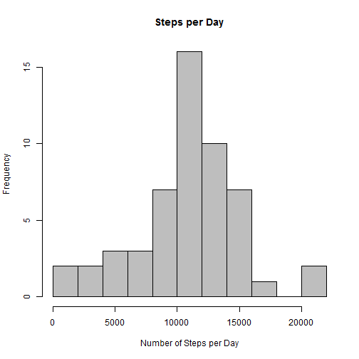
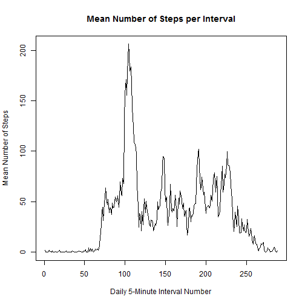
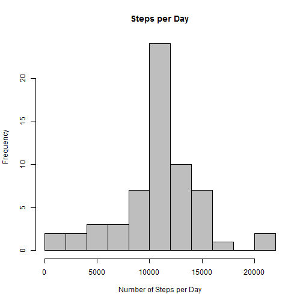
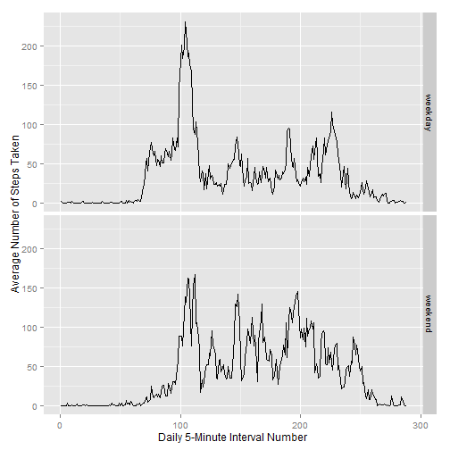

This assignment covers data produced by activity monitoring devices such as "Fitbit", "Nike Fuelband" and "Jawbone", worn by people in the "quantified self" movement. We have the data from an anonymous individual who wore the device for two months. It took counts of the number of steps taken by this individual for each 5-minute interval during the period. By analysing the data we can answer various questions about the activity.

#### Loading and preprocessing the data

```r
unzip("repdata_data_activity.zip")
activity <-read.csv("activity.csv")
head(activity, n=5)
```

```
##   steps       date interval
## 1    NA 2012-10-01        0
## 2    NA 2012-10-01        5
## 3    NA 2012-10-01       10
## 4    NA 2012-10-01       15
## 5    NA 2012-10-01       20
```

The data to be analysed was provided in a .zip file. When it was unzipped, it produced a file named activity.csv. The file activity.csv was read, which produced a data frame with the column names as shown by the first few rows.

#### What is the mean total of steps taken per day?
1. To do this we first compute the number of steps each day during the whole period. The result for the first 5 of the days is as shown.


```r
steps_by_day <- aggregate(activity$steps, by=list(activity$date), FUN=sum )
colnames(steps_by_day) <- c("Date", "Steps_per_day" )
head(steps_by_day, n=5)
```

```
##         Date Steps_per_day
## 1 2012-10-01            NA
## 2 2012-10-02           126
## 3 2012-10-03         11352
## 4 2012-10-04         12116
## 5 2012-10-05         13294
```

2. We can plot a histogram of the number of steps per day:


```r
hist(steps_by_day$Steps_per_day, breaks=10, col="gray",
     main="Steps per Day", xlab="Number of Steps per Day")
```

 

3.To calculate the mean and median:


```r
steps_mean <- round(mean(steps_by_day$Steps_per_day, na.rm=TRUE), 0)
steps_mean
```

[1] 10766

```r
steps_median <- round(median(steps_by_day$Steps_per_day, na.rm=TRUE),0)
steps_median
```

[1] 10765

So the mean steps per day is 10766 with the median at 10765.

### What is the average daily activity pattern?
1. We need to make a time series plot showing the average activity level for the same 5-minute interval over the whole period. 


```r
mean_steps_for_interval <- round(aggregate(activity$steps, by=list(activity$interval), FUN=mean, na.rm=TRUE ),1)
colnames(mean_steps_for_interval) <- c("intervl", "interval_mean")

interval_num <- as.numeric(rownames(mean_steps_for_interval))
interval_means<- cbind(mean_steps_for_interval, interval_num)
head(interval_means)
```

```
##   intervl interval_mean interval_num
## 1       0           1.7            1
## 2       5           0.3            2
## 3      10           0.1            3
## 4      15           0.2            4
## 5      20           0.1            5
## 6      25           2.1            6
```

```r
plot(interval_means$interval_num,
     mean_steps_for_interval$interval_mean, type = "l", 
    ylab="Mean Number of Steps",
    xlab="Daily 5-Minute Interval Number",
    main="Mean Number of Steps per Interval")
```

 

2. Which 5-minute interval, on average across all the days in the dataset contains the maximum number of steps? For this we extract the interval clock time against which the maximum average steps were recorded.


```r
max_row <- which.max(interval_means$interval_mean)
interval_means[max_row,1] ##(The time)
```

```
## [1] 835
```

```r
interval_means[max_row,2] ##(The value)
```

```
## [1] 206.2
```
So the most active time segment was that labelled as 08h35 with 206.2 as the average number of steps.

### Inputting missing values
1. Calculate and report on the number of missing values. We can use the summary function to calculate the missing value rows.


```r
summary(activity)
```

```
##      steps                date          interval     
##  Min.   :  0.00   2012-10-01:  288   Min.   :   0.0  
##  1st Qu.:  0.00   2012-10-02:  288   1st Qu.: 588.8  
##  Median :  0.00   2012-10-03:  288   Median :1177.5  
##  Mean   : 37.38   2012-10-04:  288   Mean   :1177.5  
##  3rd Qu.: 12.00   2012-10-05:  288   3rd Qu.:1766.2  
##  Max.   :806.00   2012-10-06:  288   Max.   :2355.0  
##  NA's   :2304     (Other)   :15840
```

This gives 2304 missing values for step count rows.

2. A strategy for filling in of the missing values. I have chosen to use the already calculated means to use for each particular interval time of the missing value.

The approach will be to create additional columns in the activity data frame by taking the shorter frame object 'interval_means' frame and duplicating it repeatedly until it contains 61 copies for the full period. Then column binding it with the original data. An examination of the head and tail of the enlarged data frame showed that the interval columns were still in synchronisation after binding.


```r
intmeans61 <- rbind(mean_steps_for_interval, mean_steps_for_interval )
for(i in 1:4) intmeans61 <- rbind(intmeans61, intmeans61)
for(i in 1:29) intmeans61 <- rbind(mean_steps_for_interval, intmeans61 )
activity2 <- cbind(activity, intmeans61)
```

The next operation is to pull the mean value across into the steps column where an NA exists in the original data. 


```r
for(i in 1:17568) if (is.na(activity2[i,1])) {
  activity2[i,1] <- activity2[i,5]
}
head(activity2)
```

```
##   steps       date interval intervl interval_mean
## 1   1.7 2012-10-01        0       0           1.7
## 2   0.3 2012-10-01        5       5           0.3
## 3   0.1 2012-10-01       10      10           0.1
## 4   0.2 2012-10-01       15      15           0.2
## 5   0.1 2012-10-01       20      20           0.1
## 6   2.1 2012-10-01       25      25           2.1
```

3. The extra 2 columns can now be dropped off, resulting in one that is equal to the original but with the missing values filled in.


```r
activity3 <- activity2[, -c(4:5)]
head(activity3)
```

```
##   steps       date interval
## 1   1.7 2012-10-01        0
## 2   0.3 2012-10-01        5
## 3   0.1 2012-10-01       10
## 4   0.2 2012-10-01       15
## 5   0.1 2012-10-01       20
## 6   2.1 2012-10-01       25
```

4. The histogram of the steps taken each day requires the daily step totals to be calculated on the new data.


```r
steps_by_day2 <- aggregate(activity3$steps, by=list(activity3$date), FUN=sum )
colnames(steps_by_day2) <- c("Date", "Steps_per_day" )
head(steps_by_day2, n=5)
```

```
##         Date Steps_per_day
## 1 2012-10-01       10766.2
## 2 2012-10-02         126.0
## 3 2012-10-03       11352.0
## 4 2012-10-04       12116.0
## 5 2012-10-05       13294.0
```
We can plot a histogram of the number of steps per day:


```r
hist(steps_by_day2$Steps_per_day, breaks=10, col="gray",
     main="Steps per Day", xlab="Number of Steps per Day")
```

 

To calculate the mean and median:


```r
steps_mean <- round(mean(steps_by_day2$Steps_per_day, na.rm=TRUE), 0)
steps_mean
```

[1] 10766

```r
steps_median <- round(median(steps_by_day2$Steps_per_day, na.rm=TRUE),0)
steps_median
```

[1] 10766

So the new mean steps per day is 10766 with the median at 10766. The mean and median are substantially the same as when using the dataset  with the NA's ignored.

What has changed is that the number of observations used increased   by 2304. Because the filled in data corresponded closely to the means of the dataset with the NA's, the mean and median were relatively unaffected, but the total number of steps and frequencies of steps within the levels increased. This is because more data had in fact been added.

Looking at the two histograms, it seems that the greatest number of steps added were from the step frequency area of 10,000 plus steps per day.

### Differences in activity patterns between weekdays and weekends
1. Create new factor variable in the dataset i.e., "day_type" with the two levels of "weekday" and "weekend".


```r
activity3$day_type <- weekdays(as.Date(activity3$date))
for(i in 1:17568) if(activity3[i,4]=="Saturday")
  activity3[i,4] <- "weekend"                      
for(i in 1:17568) if(activity3[i,4]=="Sunday")
  activity3[i,4] <- "weekend"
for(i in 1:17568) if(!activity3[i,4]=="weekend")
  activity3[i,4] <- "weekday" 
head(activity3, n=5)
```

```
##   steps       date interval day_type
## 1   1.7 2012-10-01        0  weekday
## 2   0.3 2012-10-01        5  weekday
## 3   0.1 2012-10-01       10  weekday
## 4   0.2 2012-10-01       15  weekday
## 5   0.1 2012-10-01       20  weekday
```
Prepare averages for the daily 5-minute intervals during weekdays and weekends separately. Then re-join the separate data by rows.


```r
## Subsetting by day_type
w_end_act <- subset(activity3, activity3$day_type=="weekend")
w_day_act <- subset(activity3, activity3$day_type=="weekday")

## Collapse to get interval means, add col names, add index for we
mean_inter_we <- round(aggregate(w_end_act$steps,
           by=list(w_end_act$interval), FUN=mean, na.rm=TRUE ),1)
colnames(mean_inter_we) <- c("intervl", "interval_mean")
interval_num <- as.numeric(rownames(mean_inter_we))
mean_inter_we<- cbind(mean_inter_we, interval_num)
mean_inter_we$day_type <- "weekend"

## Do the same for weekdays
mean_inter_wd <- round(aggregate(w_day_act$steps,
            by=list(w_day_act$interval), FUN=mean, na.rm=TRUE ),1)
colnames(mean_inter_wd) <- c("intervl", "interval_mean")
interval_num <- as.numeric(rownames(mean_inter_wd))
mean_inter_wd<- cbind(mean_inter_wd, interval_num)
mean_inter_wd$day_type <- "weekday"

## Now row bind with the weekend data
mean_inter_comb <- rbind(mean_inter_we, mean_inter_wd)
mean_inter_comb$day_type <- as.factor(mean_inter_comb$day_type)
```

Using ggplot2 as the panel plotting package


```r
library(ggplot2)
g <-ggplot(mean_inter_comb, aes(x=interval_num, y=interval_mean))
g <- g + geom_line() + facet_grid(day_type ~ .)
p <- g + labs(x = "Daily 5-Minute Interval Number",
             y = "Average Number of Steps Taken")
print(p)
```

 
The relative average activity during a day can now be seen with weekdays being compared with weekend days.
